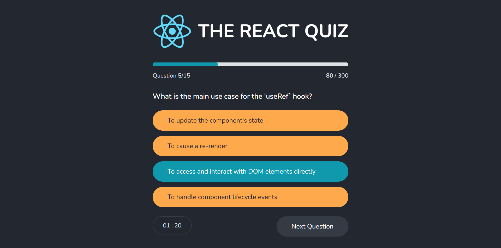
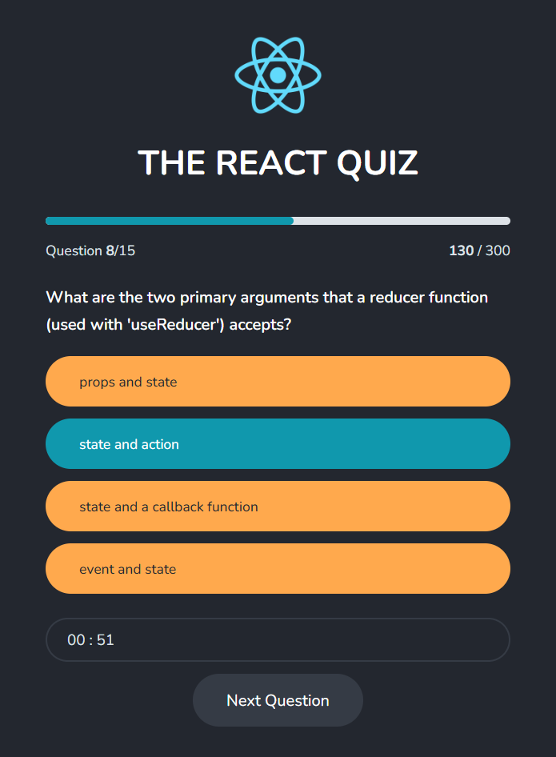

# 🏆 React Quiz App

An interactive and dynamic quiz app built with React. Test your React knowledge with a time-based multiple choice quiz that tracks your score and high score!

### 🌐 Live Demo

👉 [Try the live Application!](https://nkieu-react-quiz.vercel.app)

---

## 📸 Screenshots

<table>
  <tr>
    <td>
      
    </td>
    <td>
      
    </td>
  </tr>
</table>

---

## ✨ Features

- 🧩 **Multiple Choice Questions**: Challenge yourself with various React-related questions including hooks like `useState`, `useEffect`, `useReducer`, and `useRef`.
- 🕒 **Countdown Timer**: Each question is timed to keep you sharp.
- 🎯 **Score Tracker**: Instantly see your current points and final score.
- 🏆 **High Score System**: Tracks your personal best even after restarting.
- 🔄 **Restart Functionality**: Try the quiz again any time to improve your score.

---

## 🧠 Learning Goals

This project was developed to strengthen core React concepts, particularly:

- **React Hooks**:
  - `useState` for local UI state
  - `useReducer` for managing complex app state
  - `useEffect` for side effects and timers
- **React Context API**:
  - Used to manage and share global quiz state across the app
  - Eliminated prop drilling and made components more reusable
- **Component Composition**: Logical UI broken down into reusable components
- **Custom Logic**: Quiz logic implemented with conditional rendering and reducer actions
- **Dynamic Styling**: Visual feedback based on correct/incorrect answers

---

## 🛠️ Technology Stack

| Tech            | Description                           |
| --------------- | ------------------------------------- |
| **React**       | JavaScript UI library (v19.1.0)       |
| **JavaScript**  | Modern ES6+ features                  |
| **Vite**        | Fast build tool and dev server        |
| **json-server** | Mock REST API to serve quiz questions |

---

## 🚀 Installation & Setup

1. **Clone the repository**

   ```bash
   git clone https://github.com/nkieu-config/react-quiz-app-project.git

   ```

2. **Install dependencies**

   ```bash
   npm install
   ```

3. **Start the development server**

   ```bash
   npm run dev
   ```

4. **Start the mock API server**

   ```bash
   npm run server
   ```

⚠️ Make sure `json-server` is installed and available. The app fetches questions from `http://localhost:8000/questions`.

---

## 📚 Course Credit

This project was built as part of **[The Ultimate React Course 2025](https://www.udemy.com/course/the-ultimate-react-course/)** by [Jonas Schmedtmann](https://codingheroes.io/)

---

## 📃 License

This is a personal learning project and not intended for production use.
